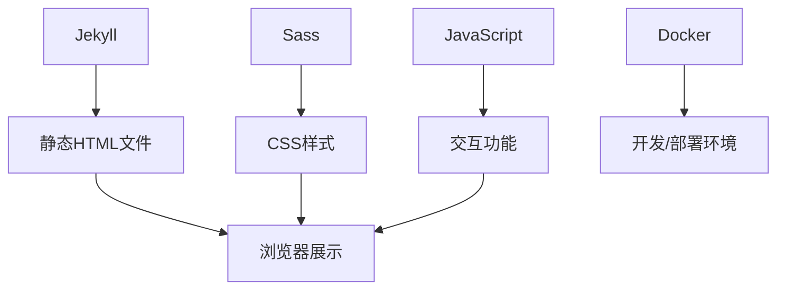

# GitHubHomePage 个人网站模板详细指南

## 1. 项目概述

GitHubHomePage 是一个基于 Jekyll 的静态站点生成器，使用 TeXt 主题。它适用于个人或团队网站、博客、项目文档等。该模板提供了高度可定制、响应式、语义化 HTML 的网站构建解决方案。

### 核心特性

- 响应式设计
- HTML 语意化
- 多种皮肤选择
- 代码高亮主题
- 国际化支持
- 搜索功能
- 目录导航
- 多作者支持
- 附加样式（提示、标签、图片、图标、按钮、栅格等）
- 扩展功能（音频、视频、幻灯片、在线示例）
- Markdown 增强（MathJax、mermaid、chartjs）
- 分享功能（AddToAny、AddThis）
- 评论系统（Disqus、Gitalk、Valine）
- 阅读量统计（LeanCloud）
- 站点统计（Google Analytics）
- RSS 支持

## 2. 技术架构

### 系统架构图



### 设计模式

1. **模板模式**：用于布局和组件复用
2. **组件模式**：将页面拆分为可复用的组件（如 header、footer、sidebar）
3. **插件模式**：通过 Jekyll 插件机制扩展功能

### 技术选型

- **前端**：HTML、CSS (Sass)、JavaScript (ES6+)
- **后端**：Jekyll（静态站点生成器）
- **数据库**：无（纯静态站点）
- **构建工具**：Docker、Jekyll、npm
- **部署方式**：GitHub Pages、Docker 容器
- **依赖管理**：package.json（Node.js）、Gemfile（Ruby）
- **版本控制**：Git
- **文档工具**：Markdown

## 3. 目录结构

```
.
├── _data                  # 数据文件（作者、许可证、导航等）
├── _includes              # 页面组件（头部、尾部、评论等）
├── _layouts               # 页面布局模板
├── _posts                 # 博客文章
├── _sass                  # Sass 样式文件
├── assets                 # 静态资源（CSS、JS、图片等）
├── docker                 # Docker 配置文件
├── test                   # 测试站点配置和页面
├── tools                  # 辅助脚本
├── _config.yml            # 主配置文件
├── package.json           # Node.js 依赖和脚本配置
└── Gemfile                # Ruby 依赖配置
```

## 4. 核心模块详解

### 4.1 配置模块

#### 主配置文件 (_config.yml)

主要配置项包括：

- **站点设置**：标题、描述、皮肤、高亮主题
- **语言和时区**：语言设置、时区配置
- **作者和社交**：作者信息、社交链接
- **路径设置**：根路径、主页路径、归档路径等
- **文章设置**：摘要分隔符、许可证、目录设置
- **Markdown 增强**：Mathjax、Mermaid、Chart 支持
- **分页设置**：每页文章数、分页路径
- **分享设置**：分享提供商配置
- **评论设置**：评论系统配置（Disqus、Gitalk、Valine）
- **阅读量统计**：LeanCloud 配置
- **搜索设置**：搜索提供商配置
- **分析设置**：Google Analytics 配置

#### 数据文件 (_data/)

- **authors.yml**：作者信息配置
- **licenses.yml**：许可证信息
- **locale.yml**：国际化语言配置
- **navigation.yml**：导航栏配置
- **variables.yml**：默认变量配置

### 4.2 布局模块

#### 布局文件 (_layouts/)

- **404.html**：404 页面布局
- **archive.html**：归档页面布局
- **article.html**：文章页面布局
- **articles.html**：文章列表页面布局
- **base.html**：基础页面布局
- **home.html**：主页布局
- **landing.html**：着陆页布局
- **none.html**：空布局
- **page.html**：普通页面布局

### 4.3 组件模块

#### 页面组件 (_includes/)

主要组件包括：

- **头部和尾部**：header.html、footer.html
- **文章相关**：article-header.html、article-info.html、article-list.html
- **评论系统**：comments.html 及 providers
- **分享功能**：sharing.html 及 providers
- **搜索功能**：search.html 及 providers
- **阅读量统计**：pageview.html 及 providers
- **Markdown 增强**：mathjax.html、mermaid.html、chart.html
- **扩展功能**：音频、视频、幻灯片等

### 4.4 样式模块

#### Sass 样式 (_sass/)

样式结构：

- **additional**：附加样式（提示、标签、相框等）
- **animate**：动画效果
- **common**：通用样式（重置、变量、函数等）
- **components**：组件样式（文章、头部、尾部等）
- **layout**：布局样式（主页、归档、文章等）
- **skins**：皮肤样式（默认、暗色、森林等）

### 4.5 功能模块

#### 评论系统

支持多种评论系统：

1. **Disqus**：国际主流评论系统
2. **Gitalk**：基于 GitHub Issues 的评论系统
3. **Valine**：基于 LeanCloud 的评论系统

#### 分享功能

支持多种分享服务：

1. **AddToAny**：综合性分享服务
2. **AddThis**：综合性分享服务

#### Markdown 增强

支持多种 Markdown 扩展：

1. **MathJax**：数学公式渲染
2. **Mermaid**：图表绘制
3. **Chart.js**：图表绘制

## 5. 内置功能和样式

### 5.1 皮肤主题

内置 6 套皮肤：

1. **default**：默认皮肤
2. **dark**：暗色皮肤
3. **forest**：森林风格
4. **ocean**：海洋风格
5. **chocolate**：巧克力风格
6. **orange**：橙色风格

### 5.2 代码高亮主题

使用 Tomorrow 系列代码高亮主题：

1. **tomorrow**：默认 Tomorrow 主题
2. **tomorrow-night**：Tomorrow 夜间主题
3. **tomorrow-night-eighties**：Tomorrow 80 年代主题
4. **tomorrow-night-blue**：Tomorrow 蓝色主题
5. **tomorrow-night-bright**：Tomorrow 明亮主题

### 5.3 附加样式

#### 提示样式

支持四种提示样式：

1. **success**：成功提示
2. **info**：信息提示
3. **warning**：警告提示
4. **error**：错误提示

#### 标签样式

支持四种标签样式：

1. **success**：成功标签
2. **info**：信息标签
3. **warning**：警告标签
4. **error**：错误标签

### 5.4 扩展功能

支持多种媒体扩展：

1. **音频**：嵌入音频播放器
2. **视频**：嵌入视频播放器（YouTube 等）
3. **幻灯片**：嵌入幻灯片展示
4. **在线示例**：嵌入 CodePen 等在线代码示例

## 6. 开发环境配置

### 必需工具

- Ruby 2.7+
- Node.js 12+
- Docker
- Jekyll
- npm / yarn

### 运行命令

- **构建命令**：`npm run build`
- **本地开发**：`npm run serve`
- **Docker 开发**：`npm run docker-dev:dev`
- **生产部署**：`npm run docker-prod:build` + `npm run docker-prod:serve`

### 代码规范

- 使用 ESLint 检查 JavaScript
- 使用 Stylelint 检查 SCSS
- 使用 Husky 和 Commitlint 规范提交信息

## 7. 部署指南

### GitHub Pages 部署

1. 将代码推送到 GitHub 仓库
2. 在仓库设置中启用 GitHub Pages
3. 选择源分支（通常是 gh-pages 或 main）

### Docker 部署

1. 构建 Docker 镜像：`npm run docker-prod:build`
2. 运行容器：`npm run docker-prod:serve`
3. 配置反向代理（如 Nginx）

## 8. 自定义配置

### 添加新页面

1. 在根目录创建新的 Markdown 或 HTML 文件
2. 设置页面布局（layout）
3. 配置页面元数据

### 自定义样式

1. 修改 `_sass/` 目录下的样式文件
2. 在 `assets/css/main.scss` 中引入自定义样式
3. 重新构建项目

### 添加新组件

1. 在 `_includes/` 目录下创建新的组件文件
2. 在布局或页面中引用组件
3. 配置组件所需的数据

## 9. 性能优化

### 静态资源优化

- 压缩 CSS 和 JavaScript 文件
- 优化图片大小和格式
- 使用 CDN 加速资源加载

### 页面加载优化

- 启用懒加载
- 减少 HTTP 请求
- 使用浏览器缓存

## 10. 安全考虑

### XSS 防护

- 对用户输入进行转义
- 使用安全的 Markdown 解析器
- 验证第三方服务集成

### 内容安全

- 不存储用户敏感数据
- 使用 HTTPS 加密传输
- 定期更新依赖包